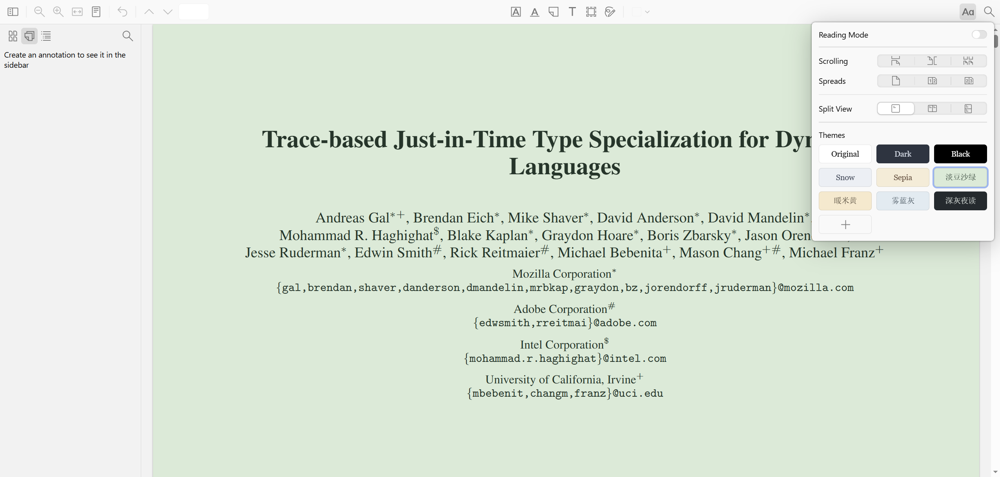
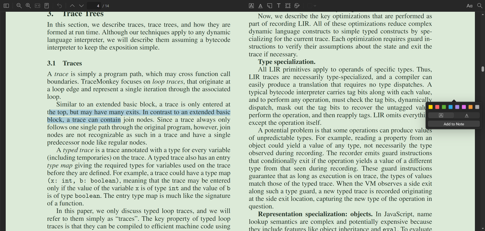

# 独立 PDF 阅读器（基于 Zotero reader）

把 Zotero 的阅读器单独拿出来做成一个纯 PDF 阅读器：双击 PDF 就能打开、支持高亮/墨迹/笔记批注、内置护眼主题，**不复制文件、不建文献库、不依赖 Zotero 桌面端**。

换色走的是 pdf.js 的 `pageColors` —— **渲染时真的替换像素颜色**，不是盖一层半透明蒙版。所以正文会被真正画成主题的前景色，而**彩色插图保持原样**。



*右侧面板里的 `淡豆沙绿 / 暖米黄 / 雾蓝灰 / 深灰夜读` 就是内置的四套护眼主题（另外 5 个是 reader 自带的）。注意标题和正文是被**真正重绘**成主题前景色的 —— 工具栏和侧栏则完全不受影响，这是"真换色"和"盖蒙版"最直观的区别。*

## 下载 / 安装

两种用法，互相独立，也可以都装：

**① Edge 扩展**（在浏览器里读 PDF）

```bash
git clone https://github.com/qqqqqqqqq1122/zotero-eye-care-reader.git
```

然后 `edge://extensions/` → 打开「开发人员模式」→「加载解压缩的扩展」→ 选 `step110_edge_ext` 目录。

**必做**：点扩展的「详细信息」，打开**「允许访问文件 URL」** —— 不开的话本地 PDF 不生效（网页 PDF 不受影响）。缺权限时工具栏图标会显示红色 `!`。

已构建好的扩展在仓库里（`step110_edge_ext/reader/`），clone 下来即可加载，不需要自己跑构建。

**② 独立桌面版**（双击 PDF 直接用）

从 [Releases](https://github.com/qqqqqqqqq1122/zotero-eye-care-reader/releases) 下载 `ZoteroReader.exe`（约 235 MB，因为内含整个 Chromium 运行时）。

想自己从源码构建的话，按 `step010` → `step090` 的顺序跑脚本，详见下文。

## Revision History

- 2026-09-19 11:39:31 — 扩展 0.4.3：**修复"下载 PDF 被拦截"**。
  自动打开只看了 `Content-Type`，没看 `Content-Disposition` —— 服务器明确要求下载（`attachment`）时照样被重定向进阅读器，文件根本没落盘。
  现在两道闸：`attachment` 直接放行；其余情况延后 250ms 跳转，跳之前确认标签页还停在该 URL 上（下载时导航会被浏览器中止，标签页会停在原来那一页），这样就区分开了"渲染"和"下载"，且不需要 `downloads` 权限。
  实测：`/test.pdf`（无 disposition）→ 自动打开阅读器；`/download.pdf`（`attachment`）→ 标签页不乱跳，文件正常下载到磁盘。
- 2026-09-18 21:49:02 — 扩展 0.4.2：**选中弹窗改为停靠在窗口右侧，并加了开关**。
  弹窗原本跟着选区跑、盖在正文中间，很挡视线。现在用带 `!important` 的 CSS 压过 reader 的内联 `transform`，把它固定在窗口右侧竖直居中；右键菜单里新增「开启/关闭选中弹窗」，状态持久化。
  实测：桌面版与扩展版的弹窗都落在 `右边缘 10px / 竖直偏差 0px`；关闭后三击选中，弹窗计算样式为 `display: none`；重载后开关状态保持。
  **补充（同日修复）**：初次实现时漏验了"右键能不能唤出菜单"，实际 `src/pdf/pdf-view.js:3668` 有 `if (this._options.platform === 'web') return;` —— web 构建里 PDF 的右键菜单**根本不弹**。已在两个 app 里把 PDF 视图对象的 `_options.platform` 改掉（只改视图对象，不动全局 platform）。现在右键菜单可用，我们的项出现在末尾。
- 2026-09-18 21:09:37 — 扩展 0.4.1：**修复侧栏布局不记忆**。两个 app 都硬编码了 `sidebarOpen: true`，且 `onToggleSidebar` / `onChangeSidebarWidth` / `onChangeSidebarView` 是空实现。已改为从设置恢复并在变更时落盘。
  注意这三个回调和主题那两个**语义不同** —— 它们不是独占的，reader 自己会应用变更，宿主只需存盘。
  实测：点击 `#sidebarToggle` → `sidebarOpen` 落盘为 `false` → 重开后侧栏保持折叠（桌面版与扩展版均已验证）。
- 2026-09-18 20:47:52 — 扩展 0.4.0：**修复本地 PDF（`file://`）不自动打开**。
  `webRequest` 对 `file://` 完全不触发，而"双击本地 PDF / 下载后点开"正是最常用的路径。加了 `chrome.tabs.onUpdated` 按 URL 后缀兜底（覆盖 file://），并在启动时用 `isAllowedFileSchemeAccess()` 自检 —— 没权限就在工具栏图标挂红色 `!` 徽标提示去开「允许访问文件 URL」。
  实测：`file://` PDF 自动跳转 → 阅读器成功 `fetch` → 渲染出 38 页（canvas 2106x2976）。
- 2026-09-18 20:38:05 — 修复两个 bug + 换图标。
  **(1) 主题不记忆**：两个 app 都没传 `onSetLightTheme` / `onSetDarkTheme`，reader 走回退分支只改内存不落盘；已改为透传回调并自己完成「应用 + 存盘」，启动时从设置恢复。桌面版与扩展版均已实测「换主题 → 重开 → 主题还在」。
  **(2) 扩展不自动打开**：原定用内容脚本检测，实测 **PDF 页面不注入内容脚本**（`getContexts()` 只返回 `BACKGROUND`），改用 `webRequest.onHeadersReceived` 看响应头 `Content-Type`，已实测导航到 PDF 会自动跳转。
  新增 step120（生成 PDF 风格图标）与 step130（用 Win32 `UpdateResource` 注入 exe 资源段）。
- 2026-09-18 20:20:49 — 新增 step110：Edge 扩展（方案 B）。把已构建的 reader 搬进 MV3 扩展，用 `fetch` + `chrome.storage` 替代桌面版的本地 HTTP 服务。产物 `G:\setting_pdf_reader\step110_edge_ext`（245 个文件，11.7 MB）。实测在 Edge 153 中加载成功，画布像素分布与桌面版**逐字节一致**，确认为真正的 `pageColors` 换色而非滤镜。
- 2026-09-18 20:08:55 — 初版。完成 step010–step100 全流程：源码拉取、依赖与语言文件、pdfjs 与 web 目标构建、Electron 外壳、app 资源准备、打包、文件关联注册。产物 `G:\setting_pdf_reader\step090_dist\ZoteroReader.exe`（379.2 MB）经实测可双击打开 PDF，护眼主题生效，阅读状态持久化已验证。

---

## 为什么要自建（结论先行）

最初的诉求是「把系统 PDF 阅读器设为 Zotero，双击用 Zotero 打开，但不要入库」。经查证，这个诉求在 Zotero 上**不可能实现**，原因是硬性的：

1. **Zotero 没有「纯阅读器」模式。** 官方论坛原话（有人问能否只读不入库）：

   > "an attachment needs to be in your library to view it in the built-in reader. That's unlikely to change."

2. **`zotero.exe` 不认裸文件路径参数。** 源码 `app/assets/commandLineHandler.js` 显示只认 `-file` / `-url` 这类带参开关；而 `-file` 的真实行为在 `chrome/content/zotero/xpcom/commandLineHandler.js` 里写得很清楚 —— 它不是「打开」，是**导入**：

   ```js
   // Ask before importing
   if (Services.prompt.confirmCheck(null, ..., 'ingester.importFile.title', ...)) {
       mainWindow.Zotero_File_Interface.importFile({ file, ... });   // 复制进 storage
   }
   ```

   实测也印证：`zotero.exe "<一个库外的PDF>"` 启动后 `D:\Zotero\storage` 文件夹数 5 → 5，文件根本没被加载。

3. **你下载的 `zotero-main.zip` 里没有阅读器代码。** `reader/`、`document-worker/`、`translators/` 都是**空的 git 子模块**（各只有 1 个条目 = 目录本身）。GitHub 的 "Download ZIP" 不打包子模块内容。真正的 PDF 引擎在独立仓库 `https://github.com/zotero/reader`。

4. **Zotero 插件（XPI）装不进自建程序。** `zotero-open-pdf` 和 `zotero-eye-care` 都是 Zotero **应用层** bootstrapped 扩展，依赖 `Zotero` 应用对象、XULRunner 的 `Cc/Ci/Cu`、Zotero 主窗口菜单体系 —— 自建程序是 Electron，这些全都不存在。

   但 **`zotero-eye-care` 的功能是可移植的**：它只是把 4 个主题写进 `readerCustomThemes` 设置，而 reader 构造函数本来就认 `customThemes` 选项。所以护眼主题被**原样搬进了本项目**（见 step060）。

---

## 目录结构

```
G:\setting_pdf_reader\
├── README.md                              ← 本文件
├── step010_fetch_reader.ps1               ← 拉取源码
├── step010_reader_src\                    ← zotero/reader 源码树（分支 10.0）
├── step010_fetch_manifest.txt
├── step020_install_deps.ps1               ← 安装依赖 + 准备语言文件
├── step020_npm_install.log
├── step030_devserver.log                  ← dev server 验证日志
├── step040_pdfjs_build.log                ← pdfjs 构建日志
├── step050_web_build.log                  ← web 目标构建日志
├── step060_app\                           ← Electron 外壳源码
│   ├── main.js
│   ├── package.json
│   ├── reader-build\                      ← step080 复制进来的 reader 构建产物
│   └── renderer\
│       ├── index.html
│       ├── app.js
│       └── eye-care-themes.js
├── step080_prepare_app.ps1
├── step080_prepare_manifest.txt
├── step090_package_app.ps1
├── step090_dist\                          ← 可分发产物
│   ├── ZoteroReader.exe
│   └── resources\app\                     ← 主进程 + 渲染进程 + reader-build
├── step090_package_manifest.txt
├── step100_register_association.ps1
├── step100_association_manifest.txt
├── step110_prepare_ext.ps1                 ← 把 reader 构建产物搬进扩展目录
├── step110_make_icons.ps1                  ← 生成扩展图标
├── step110_cdp_probe.ps1                   ← CDP 探针（调试用）
├── step110_testserver.mjs                  ← 临时测试服务器（非交付物）
├── step110_edge_ext\                       ← Edge 扩展本体
│   ├── manifest.json
│   ├── background.js
│   ├── icons\
│   └── reader\                             ← reader 页面 + 构建产物
│       ├── reader.html
│       ├── app.js
│       ├── eye-care-themes.js
│       ├── reader.js / reader.css
│       └── pdf\  mathjax-fonts\
├── step110_ext_shot.png                    ← 扩展在 Edge 里的实拍
├── step120_make_pdf_icon.ps1               ← 生成 PDF 风格 .ico
├── step120_pdf_icon.ico
├── step120_icon_<16..256>.png              ← 各尺寸预览
├── step130_set_exe_icon.ps1                ← 把图标注入 exe 资源段
└── step130_icon_check.png                  ← 从 exe 里抽出来的图标（验证用）
```

---

## step010 — 拉取 zotero/reader 源码

```powershell
& "G:\setting_pdf_reader\step010_fetch_reader.ps1"
```

- 仓库：`https://github.com/zotero/reader.git`，分支 **`10.0`**（对应本机 Zotero 10.0.3，比 master 稳）
- 落地：`G:\setting_pdf_reader\step010_reader_src`，提交 `3e6826bc06305ff8495e58bb03a62ef010474564`
- 三个子模块会一并拉取：`pdfjs/pdf.js`、`epubjs/epub.js`、`structured-document-text`

## step020 — 安装依赖与准备语言文件

```powershell
& "G:\setting_pdf_reader\step020_install_deps.ps1"
```

**这里有一个必须记住的坑**：`webpack.zotero-locale-plugin.js` 会从 `https://raw.githubusercontent.com/zotero/zotero/<commit>` 下载 `.ftl` 语言文件，而**本机 `raw.githubusercontent.com` 无法解析**，且该插件**不跟随重定向**（非 200 直接失败），所以照原样构建必然失败。

绕过办法：改从 jsDelivr CDN 镜像按同一 commit 拉取，写入源码树的 `locales\en-US\`，并写 `locales\.signature` 记录 commit —— 插件读到一致就跳过下载。

```powershell
# 语言文件来源（commit 取自 step010_reader_src\.zotero-locale-commit）
# https://cdn.jsdelivr.net/gh/zotero/zotero@a6a919234a360f5cc0f8dbf45b84e1fafc546f41/chrome/locale/en-US/zotero/zotero.ftl
# https://cdn.jsdelivr.net/gh/zotero/zotero@a6a919234a360f5cc0f8dbf45b84e1fafc546f41/chrome/locale/en-US/zotero/reader.ftl
# https://cdn.jsdelivr.net/gh/zotero/zotero@a6a919234a360f5cc0f8dbf45b84e1fafc546f41/app/assets/branding/locale/brand.ftl
```

- npm registry 已是国内镜像 `https://registry.npmmirror.com/`，1697 个包约 26 秒装完
- reader 的构建脚本依赖 **bash**（`PDFJS_CONFIG=all bash pdfjs/build`），必须用 Git Bash，PowerShell 跑不了

## step030 — dev server 验证

```bash
cd /g/setting_pdf_reader/step010_reader_src && NODE_OPTIONS=--openssl-legacy-provider npm start
```

打开 `http://localhost:3000/dev/reader.html?type=pdf`。dev 构建会把 `demo/pdf/demo.pdf` 复制进构建目录，是验证「阅读器能否脱离 Zotero 渲染 PDF」的最快入口。

日志见 `G:\setting_pdf_reader\step030_devserver.log`。

## step040 — 构建 pdfjs

```bash
cd /g/setting_pdf_reader/step010_reader_src && PDFJS_CONFIG=dev bash pdfjs/build
```

产出 `G:\setting_pdf_reader\step010_reader_src\build\dev\pdf\`（viewer.html、viewer.mjs、pdf.worker.mjs、cmaps、standard_fonts、wasm）。

`npm start` **不会**跑这一步，而 reader 的 PDF 视图是 iframe 加载相对路径 `pdf/web/viewer.html`（见 `src/pdf/pdf-view.js:188`），所以缺了它页面会报 `Cannot GET /dev/pdf/web/viewer.html`。

日志见 `G:\setting_pdf_reader\step040_pdfjs_build.log`。

## step050 — 构建 web 目标

```bash
cd /g/setting_pdf_reader/step010_reader_src && NODE_OPTIONS=--openssl-legacy-provider npx webpack --config-name web
cp -r build/dev/pdf build/web/pdf
```

用 `web` 而不是 `dev` 的原因：`src/index.web.js` 暴露 `window.createReader(options)` 工厂且**不自动实例化**；`src/index.dev.js` 则在模块末尾直接调用 `createReader()` 打开 demo，不适合做外壳。

`pdf/` 目录直接复用 step040 的 generic 构建产物 —— Electron 用的是现代 Chromium，不需要 web 目标默认的 legacy 版本。

日志见 `G:\setting_pdf_reader\step050_web_build.log`。

## step060 — Electron 外壳

`G:\setting_pdf_reader\step060_app\main.js`

- 从 `process.argv` 取 PDF 路径（打包后切片位置不同，用 `app.isPackaged` 区分）
- 起本地 HTTP 服务（随机端口，仅监听 127.0.0.1），把 reader 构建产物、`renderer\` 和动态端点一起伺服
- 单实例锁：第二次双击复用已有窗口并重新加载
- 动态端点：`/__doc`、`/__pdf`、`/__annotations`、`/__state`、`/__themes`、`/__screenshot`、`/__openExternal`、`/__pickFile`

**为什么用 HTTP 而不是 `file://`**：reader 用 ES module、Worker、wasm，并用 iframe 加载 PDF 视图，`file://` 下会被同源策略挡住。

`G:\setting_pdf_reader\step060_app\renderer\app.js`

- 取 `/__pdf` 拿字节流，交给 `window.createReader({ data: { buf } })`
- 三个回调接本地存储：`onSaveAnnotations` / `onDeleteAnnotations` / `onChangeViewState`
- 注入 `window.EYE_CARE_THEMES`（见下）

`G:\setting_pdf_reader\step060_app\renderer\eye-care-themes.js`

护眼主题逐字取自 `zotero-eye-care` 插件（作者 ZhaoPuEE，`https://github.com/ZhaoPuEE/zotero-eye-care`）的 `content/theme-presets.js`：

| id | 名称 | 背景 | 前景 |
|---|---|---|---|
| `zotero-eye-care-green` | 淡豆沙绿 | `#DCEAD8` | `#26352A` |
| `zotero-eye-care-warm-yellow` | 暖米黄 | `#F5E9CE` | `#40372A` |
| `zotero-eye-care-mist-blue` | 雾蓝灰 | `#E3EBF1` | `#293742` |
| `zotero-eye-care-night-gray` | 深灰夜读 | `#252A2E` | `#D7DDD9` |

**`renderer\index.html` 有一个必须遵守的约束**：`<script>` 只能放在 `</body>` 之前，**不能放 `<head>`**。因为 `reader.js` 在模块求值时会执行 `window.getComputedStyle(document.body)`，放 head 里时 `document.body` 还是 `null`，直接抛 `TypeError`，导致 `window.createReader` 根本没机会挂上。Zotero 自己的 `index.reader.html` 模板里没有 script 标签 —— 是 HtmlWebpackPlugin 把脚本注入到 body 末尾的。

## step080 — 准备 app 资源

```powershell
& "G:\setting_pdf_reader\step080_prepare_app.ps1"
```

把 `G:\setting_pdf_reader\step010_reader_src\build\web` 复制到 `G:\setting_pdf_reader\step060_app\reader-build`（238 个文件，11.7 MB）。主进程按 `[reader-build/, ../step010_reader_src/build/web]` 顺序查找，打包后源码树不存在，必须复制进来。

清单见 `G:\setting_pdf_reader\step080_prepare_manifest.txt`。

## step090 — 打包

```powershell
& "G:\setting_pdf_reader\step090_package_app.ps1"
```

产出 `G:\setting_pdf_reader\step090_dist\ZoteroReader.exe`（316 个文件，379.2 MB）。

**为什么手工组装而不用 electron-builder**：electron-builder 需额外下载 winCodeSign / nsis 等二进制，走 GitHub Releases 重定向，本机对相关域名解析失败风险高。手工组装只用本地已下载好的 electron dist，完全离线。

运行方式：

```powershell
& "G:\setting_pdf_reader\step090_dist\ZoteroReader.exe" "D:\某个文件.pdf"
```

清单见 `G:\setting_pdf_reader\step090_package_manifest.txt`。

## step100 — 注册文件关联

```powershell
& "G:\setting_pdf_reader\step100_register_association.ps1"
```

完成的事：

- 删除野路子 ProgID `HKCU\Software\Classes\pdf_auto_file`（原值 `"D:\Zotero\zotero.exe" "%1"`）
- 注册 `HKCU\Software\Classes\ZoteroReader.pdf`，`shell\open\command` = `"G:\setting_pdf_reader\step090_dist\ZoteroReader.exe" "%1"`
- 注册 `HKCU\Software\Classes\Applications\ZoteroReader.exe`，`SupportedTypes` 含 `.pdf`，`FriendlyAppName` = `ZoteroReader 阅读器`
- 把 `HKCU\Software\Classes\.pdf` 的兜底 ProgID 由空壳 `winupdf` 改指到 `ZoteroReader.pdf`
- 把 `ZoteroReader.pdf` 加入 `HKCU\Software\Microsoft\Windows\CurrentVersion\Explorer\FileExts\.pdf\OpenWithProgids`

**做不到的事（Windows 的设计，不是脚本问题）**：

`HKEY_CURRENT_USER\Software\Microsoft\Windows\CurrentVersion\Explorer\FileExts\.pdf\UserChoice` 才是决定「双击用哪个程序」的键，但本机 **UCPD（User Choice Protection Driver）服务处于 Running 状态**（`C:\WINDOWS\System32\drivers\UCPD.sys`，StartType = System），实测任何脚本写入都被拒绝：

```
Requested registry access is not allowed.
```

**不过实测兜底路径是生效的**：在 `UserChoice` 悬空的情况下，用 ShellExecuteEx（与双击同一条路径）打开 PDF，窗口标题确实切换到了新文档，即 Windows 采纳了 `HKCU\Software\Classes\.pdf` 的指向。

想更稳妥的话，手动指定一次默认程序：在 PDF 上右键 → 打开方式 → 选择其他应用 → 选「ZoteroReader 阅读器」→ 勾选「始终使用此应用打开 .pdf 文件」。

清单见 `G:\setting_pdf_reader\step100_association_manifest.txt`。

## step110 — Edge 扩展（方案 B：真 pageColors）

```powershell
& "G:\setting_pdf_reader\step110_prepare_ext.ps1"   # 复制 reader 构建产物到扩展目录
& "G:\setting_pdf_reader\step110_make_icons.ps1"    # 生成图标
```

产物：`G:\setting_pdf_reader\step110_edge_ext`（245 个文件，11.7 MB）

### 为什么不给 Edge 原生查看器上色

实测顶层 PDF 页面的 DOM：

```json
{ "contentType": "application/pdf", "bodyChildren": [], "embedCount": 0, "bodyHTMLLength": 10 }
```

**body 是空的，没有任何 `embed` 元素** —— Edge 的 PDF 查看器在进程外渲染，DOM 里根本不存在。因此：

| 需要的能力 | Edge 原生查看器 |
|---|---|
| 拿到 canvas 逐像素处理 | ❌ 没有 canvas |
| 区分文字层与图片层 | ❌ 没有 DOM |
| 只给文档区域上色 | ❌ 滤镜加在 `html` 上会连工具栏一起染 |
| 调 pdf.js 的 pageColors | ❌ 它根本不是 pdf.js，也不暴露渲染接口 |

唯一可用的钩子是 `html { filter: … }`，实测可行但**整个查看器界面会被一起滤镜**，且图片无法幸免。这正是 `zotero-eye-care` 那种插件式的做法，不是 Zotero reader 的做法。

**所以本方案改用扩展自带页面承载 reader**，从而拿到真正的 `pageColors`。

### 架构

| 环节 | 做法 |
|---|---|
| 扩展形态 | Manifest V3，`background.js` 为 service worker |
| 自动打开（网页 PDF） | `webRequest.onHeadersReceived` 看响应头 `Content-Type: application/pdf`；`Content-Disposition: attachment` 的**直接放行**（那是下载，不是阅读） |
| 自动打开（本地 PDF） | `chrome.tabs.onUpdated` 按 URL 后缀 `.pdf` 判断 —— **`webRequest` 对 `file://` 完全不触发**，必须另开一条路 |
| 手动触发 | 工具栏图标（当前页是 PDF 时直接打开）、右键菜单（PDF 链接 / PDF 页面） |
| reader 页面 | 扩展页 `reader/reader.html`，同源加载 `pdf/web/viewer.html`，不需要 `web_accessible_resources` |
| PDF 来源 | `fetch(src)`，靠 `<all_urls>` host 权限跨域取字节 |
| 持久化 | `chrome.storage.local`，键为 `doc:<sha1(PDF URL)>` |
| **CSP** | `script-src 'self' 'wasm-unsafe-eval'` —— **必须加 `'wasm-unsafe-eval'`**，pdf.js 的 jbig2 / openjpeg / qcms 都要用 WebAssembly |

`reader/app.js` 写了存储抽象：`chrome.storage` 不存在时回退到 `localStorage`。这样可以用 `step110_testserver.mjs` 纯 HTTP 先把阅读器逻辑跑通，不必每次装扩展调试。

### 安装（在你自己的 Edge 里）

1. 打开 `edge://extensions/`
2. 打开左下角「开发人员模式」
3. 点「加载解压缩的扩展」，选 `G:\setting_pdf_reader\step110_edge_ext`
4. 工具栏出现图标即成功

5. **必做**：点本扩展的「详细信息」，打开**「允许访问文件 URL」**

第 5 步不是可选项 —— 不开的话**本地 PDF（双击打开、下载后点开）一律不生效**：扩展连 `file://` 标签页的 URL 都读不到，`webRequest` 和 `tabs.onUpdated` 两条路全都沉默。网页 PDF 不受影响。

扩展会自检：没开这个权限时，工具栏图标上会挂一个**红色 `!` 徽标**，鼠标悬停有说明。装上后看到 `!` 就是缺这一步。

### 实测验证（Edge 153.0.4234.32，全新 profile）

| 检查项 | 结果 |
|---|---|
| 扩展注册 / service worker | `chrome-extension://flbjpbjbpakpniemdhdcfnkpafacncoe/background.js` 运行中 |
| 页面 origin | `chrome-extension://` ✓ |
| `chrome.storage` 可用 | true |
| **WebAssembly 在扩展 CSP 下编译** | **OK**（最小模块 + pdf.js 的 wasm 资源均可加载） |
| `pdf.worker.mjs` / `viewer.html` | HTTP 200 / 200 |
| 真实 PDF 端到端 | 打开后 `chrome.storage.local` 写入 `doc:c6720d71…`（含 `pageIndex`/`scale`/`top`） |

**画布像素对照**（这是"真 pageColors vs 盖蒙版"最硬的判据）：

| | 桌面版 step060 | Edge 扩展 step110 |
|---|---|---|
| 画布 CSS | `filter: none` / `mix-blend-mode: normal` | 相同 |
| 纸面像素 | `220,234,216 a255` × 1489 | **相同** |
| 文字像素 | `38,53,42 a255` × 12 | **相同** |
| 批注颜色 | 黄/蓝原色保留 | 相同 |

### 调试工具

`G:\setting_pdf_reader\step110_cdp_probe.ps1` —— 通过 CDP 连到运行中的浏览器求值/截图：

```powershell
# 先带扩展启动一个独立 profile
& $edge --user-data-dir=$env:TEMP\edge-ext-test --load-extension=G:\setting_pdf_reader\step110_edge_ext --remote-debugging-port=9333

# 再探针
& "G:\setting_pdf_reader\step110_cdp_probe.ps1" -Port 9333 -UrlMatch "reader.html" `
    -Navigate "chrome-extension://<扩展ID>/reader/reader.html?src=<PDF URL>" `
    -Expression "(async()=>1)()" -ScreenshotPath "G:\setting_pdf_reader\shot.png"
```

### 已知限制

- **替换了 Edge 原生查看器**。用的是 Zotero 的阅读器，不是 Edge 那个 —— Edge 原生查看器的表单填写等功能在这里没有。
- **标签弹窗未实现**（`onOpenTagsPopup` 是空实现），与桌面版一致。
- **不同步 Zotero**。批注存在 `chrome.storage.local`，与桌面版的 `ZoteroReader.exe` 各自独立，互不相通。
- **朗读关闭**（依赖 Zotero 的 TTS 服务）。
- **`<all_urls>` 权限较宽**。因为 PDF 可能来自任意站点，这是必要的代价。
- **本地 PDF 依赖「允许访问文件 URL」**。这是 Chromium 的权限设计，代码无法代劳，只能用户在 `edge://extensions` 里手动开。缺权限时工具栏图标会显示红色 `!`。
- **下载 PDF 不会被拦截**（v0.4.3 起）。`Content-Disposition: attachment` 的响应直接放行；没有该响应头的下载（`<a download>`、右键「链接另存为」）靠"延迟跳转 + 确认标签页是否还停在该 URL"来区分 —— 下载时导航会被浏览器中止，标签页留在原来那一页，于是不跳。
  仍有极小概率误判（例如下载瞬时的 URL 恰好与导航 URL 一致），真要下载时可靠的做法是在工具栏图标上右键**关掉自动打开**。
- **自动打开时「后退」有 30 秒窗口**。按后退回到 PDF 会被立刻弹回阅读器，所以代码里记了「刚重定向过的 URL」，30 秒内不再重定向。超过 30 秒再按后退仍会被弹回 —— 想稳定看原生查看器就先把自动打开关掉（工具栏图标上右键）。
- **主题按系统配色分槽**。系统是深色时，点主题存进 `darkTheme`；浅色时存进 `lightTheme`。两个槽都持久化了，所以切换系统主题也能各记各的。
- **分发义务**：reader 为 AGPL-3.0，若要上架或分发衍生作品，源码需按 AGPL 开放。

### 踩过的几个坑（2026-09-18 修复）

**坑一：主题换了不记忆。**
`src/common/reader.js:430-448`：

```js
onChangeTheme={(theme) => {
    if (getCurrentColorScheme(this._state.colorScheme) === 'dark') {
        if (this._onSetDarkTheme) { this._onSetDarkTheme(theme); }   // 宿主接管（Zotero 存 pref）
        else { this.setDarkTheme(theme); }                            // 回退：只改内存
    } else { /* 同理 lightTheme */ }
}}
```

两个 app 都没传 `onSetLightTheme` / `onSetDarkTheme`，于是走回退分支 —— **主题只改了内存，没有任何持久化**，重开自然回到默认。而且**一旦提供回调，reader 就不自己调 `setLightTheme` 了**，所以回调里必须「应用 + 存盘」两件事都做。

另外注意：主题按系统配色存进 light 或 dark **两个不同的槽**，两个都要恢复。

**坑二：侧栏布局不记忆。**
`sidebarOpen` / `sidebarWidth` / `sidebarView` 三个初始值被硬编码，而 `onToggleSidebar` / `onChangeSidebarWidth` / `onChangeSidebarView` 是空实现，所以每次打开都是默认展开。

**但这里的语义和主题那两个回调相反**（`src/common/reader.js:418-429`）：

```js
onToggleSidebar={(open) => {
    this.toggleSidebar(open);        // reader 自己先应用了
    this._onToggleSidebar(open);     // 只是通知宿主
}}
```

**不是独占的** —— 宿主只需存盘，**不要再调 `setSidebarXxx`**（调了等于重复应用）。主题那边则是提供了回调 reader 就不自己调了，两边正好相反，容易搞混。

还有个细节：`onToggleSidebar` 的入参可能是 `undefined`（表示"切换"），所以落盘时要取 `reader._state.sidebarOpen` 的实际值 —— `_updateState` 是同步赋值（`reader.js:620`），回调触发时它已经是新值了。

**坑三：自动打开需要改机制。**
最初想用内容脚本检测 `document.contentType === 'application/pdf'`。实测行不通 —— 在 PDF 标签页上调 `chrome.runtime.getContexts()` **只返回 `BACKGROUND`，没有 `CONTENT_SCRIPT`**。原因：PDF 查看器本体是 `chrome-extension://mhjfbmdgcfjbbpaeojofohoefgiehjai/edge_pdf/index.html`，文档在 OOPIF 里（CDP 目标类型会显示成 `webview` + `iframe`），**Chromium 不往 PDF 页面注入内容脚本**。

改用 `webRequest.onHeadersReceived`（只读观测，不需要 `webRequestBlocking`，MV3 允许）。它直接看响应头的 `Content-Type`，比匹配 `.pdf` 后缀可靠 —— `arxiv.org/pdf/2401.12345` 这种没后缀的也能抓到。实测事件**确实能唤醒休眠的 Service Worker**。

**坑四（调试经验）：`--load-extension` 会复用缓存的 Service Worker。**
改了扩展代码后光重启浏览器**不会重新读盘**，SW 跑的还是旧代码（表现为 `typeof 新函数 === "undefined"`、`hasListeners()` 为 false）。必须在 `edge://extensions` 点「重新加载」，或在 SW 里调 `chrome.runtime.reload()`。

## step120 — 生成 PDF 风格图标

```powershell
& "G:\setting_pdf_reader\step120_make_pdf_icon.ps1"
```

用 System.Drawing 画「白纸 + 右上折角 + 红色 PDF 色带」，输出多尺寸 `.ico`（16/24/32/48/64/128/256，PNG 压缩条目，Windows Vista+ 支持）。16px 下不画文字只留色带 —— 那个尺寸画字只会糊成一团。

产出：`G:\setting_pdf_reader\step120_pdf_icon.ico`，以及 `G:\setting_pdf_reader\step120_icon_<size>.png` 各尺寸预览。

## step130 — 把图标注入 exe

```powershell
& "G:\setting_pdf_reader\step130_set_exe_icon.ps1"
```

**必须在 step090 打包之后运行** —— step090 会重建整个 `step090_dist`，把它们反过来就会白做。

exe 的图标是编译进资源段的，改文件名或放个 `.ico` 在旁边都没用。这里用 Win32 的 `BeginUpdateResource` / `UpdateResource` / `EndUpdateResource` 直接替换：

- `RT_ICON`（类型 3）：每个尺寸一条，ID 从 1 开始
- `RT_GROUP_ICON`（类型 14）：ID 1，把它们串起来。注意结构与 `.ico` 的 `ICONDIR` 类似，但最后一项是**资源 ID** 而不是文件偏移
- 语言用 1033（Electron 资源用的就是这个）

改完会顺带影响 **`.pdf` 文件的图标** —— step100 注册的 `DefaultIcon` 指向 `"<exe>",0`。

脚本最后会把图标从 exe 里抽出来存成 `G:\setting_pdf_reader\step130_icon_check.png` 供肉眼验证（只信脚本打印的"成功"是不够的）。

**副作用**：改资源会让 exe 的 Authenticode 签名失效。实测 Electron 的预编译二进制本来就是 `NotSigned`，所以**没有额外影响**。

---

## 界面定制：选中弹窗

选中文字时弹出的批注工具栏，**默认停靠在窗口右侧竖直居中**（纸张外的空白处），不再盖在正文中间。



**开关**：在 PDF 上右键 → 「关闭选中弹窗」/「开启选中弹窗」。状态会记住，重启后保持。

### 前提：右键菜单默认是关掉的

`src/pdf/pdf-view.js:3668`：

```js
if (this._options.platform === 'web') {
    return;                      // ← web 构建里 PDF 的右键菜单直接不工作
}
```

而 `src/index.web.js` 会把 `platform` 写死成 `'web'`。所以**独立版默认在 PDF 上右键什么都不会发生**。

修法是创建 reader 后把视图对象的 platform 改掉 —— **只改视图这一个对象，不动全局 `platform`**，因为全局改会波及 `thumbnails-view`、`appearance-popup`、`annotations-view` 等好几处 `platform === 'web'` 的分支：

```js
function enablePdfContextMenu(r) {
    for (const v of (r._views || [])) {
        if (v && v._options && v._options.platform === 'web') {
            v._options.platform = 'electron';
        }
    }
}
// createReader 之后调用一次，initializedPromise 之后再补一次（视图可能延迟创建）
```

> **副作用**：在 Edge 扩展里，reader 的右键菜单会**取代浏览器原生菜单**，所以右键不再有「另存为 / 打印 / 检查」。桌面版没有这个问题（Electron 本来就没有默认右键菜单）。如果更想要浏览器原生菜单，可以把扩展里这段 patch 去掉，改用别的方式开关弹窗。

### 实现方式（**不需要改 reader 源码重新构建**）

```css
.view-popup.selection-popup {
    position: fixed !important;
    transform: none !important;
    translate: 0 -50% !important;
    top: 50% !important;
    right: 10px !important;
    left: auto !important;
}
body.zr-hide-selection-popup .view-popup.selection-popup {
    display: none !important;
}
```

两个关键点：

1. **必须用 `!important`**。`ViewPopup` 是用**内联 style 的 `transform`** 定位的（`src/common/components/view-popup/common/view-popup.js:167`）。不带 `!important` 的内联样式会输给带 `!important` 的样式表规则，所以这里能压过它。
2. **竖直居中用 `translate` 属性而不是 `transform`**。因为上面已经把 `transform` 强制成 `none` 了 —— `translate` 是独立于 `transform` 的 CSS 属性，两者互不影响。

开关通过拦截 `onOpenContextMenu` 把自定义菜单项追加进 reader 原有的菜单（跳过 `internal` 的内部浮层）：

```js
onOpenContextMenu: (params) => {
    if (params.internal || !Array.isArray(params.itemGroups)) {
        return reader.openContextMenu(params);
    }
    return reader.openContextMenu({
        ...params,
        itemGroups: [...params.itemGroups, [{
            label: popupEnabled ? '关闭选中弹窗' : '开启选中弹窗',
            onCommand: () => setPopupEnabled(!popupEnabled),
        }]],
    });
},
```

> 注意：这个入口会出现在**所有非内部右键菜单**里（正文、批注等）。这是由 reader 的菜单分发决定的 —— 各类菜单共用 `onOpenContextMenu` 这一个出口，params 里没有区分类型的字段。

---

## 数据存放位置

都在 Electron 的 `userData` 目录下，即 `%APPDATA%\zotero-reader-standalone\`：

| 内容 | 路径 |
|---|---|
| 批注与阅读状态 | `%APPDATA%\zotero-reader-standalone\docs\<sha1(文件绝对路径)>.json` |
| 全局设置（自定义主题 + 当前选中的 light/dark 主题） | `%APPDATA%\zotero-reader-standalone\settings.json` |
| 服务端口（调试用） | `%APPDATA%\zotero-reader-standalone\port.txt` |

> `%APPDATA%` 在某些机器上会被重定向（例如整个用户配置目录挪到别的盘），
> 用 `echo %APPDATA%` 或 `$env:APPDATA` 查实际位置。

批注按 **PDF 文件绝对路径的 SHA1** 索引，**不复制、不移动原文件**。

> **查看这些 JSON 时注意编码**：文件是 UTF-8。用 PowerShell 的 `Get-Content` 直接读会按系统 ANSI（中文 Windows 上是 GBK）解码，中文会显示成 `缃戠粶鍥炲綊妯` 这类乱码，并导致 `ConvertFrom-Json` 报 `Invalid object passed in`。这是**读取方式的问题，不是文件坏了**。要正确读取请用 `Get-Content -Encoding UTF8`，或直接用支持 UTF-8 的编辑器打开。

## 已知限制

- **朗读功能已关闭**。`enableReadAloud: false` —— 原功能依赖 Zotero 的 TTS 服务（`api.zotero.org/tts/*`）和 API key。
- **结构化文档文本（SDT）不可用**。`document-worker` 不在 `zotero/reader` 仓库里（Zotero 开发时把它和 reader 放在同级目录），缺失时代码会优雅降级，只影响朗读与智能引用弹窗。
- **标签弹窗未实现**。`onOpenTagsPopup` 目前是空实现，点批注的加标签入口没有反应。
- **批注不能与 Zotero 同步**。存在本地 JSON，不回写 `zotero.sqlite`。
- **不能双击打开 EPUB**。主进程白名单里有 `.epub`，但 `app.js` 固定 `type: 'pdf'`，需要额外接 EPUB 分支。
- **分发义务**：reader 与 Zotero 均为 **AGPL-3.0**。自用无妨，若要分发给他人，衍生作品源码也需按 AGPL 开放。

## 参考

- Zotero reader 源码：`https://github.com/zotero/reader`
- Zotero 文件处理问题官方文档：`https://www.zotero.org/support/kb/file_handling_issues`
- 护眼主题来源：`https://github.com/ZhaoPuEE/zotero-eye-care`
